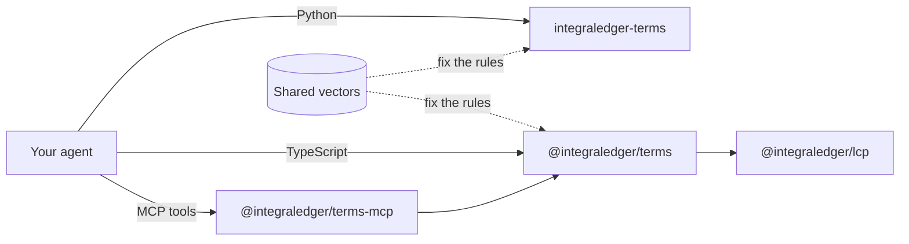

# integra-agentic-terms

The buyer side of the Legal Context Protocol: packages that let an agent confirm, before it pays, that the payment it
signs carries the hash of the exact record the seller serves.

## What this repository is

A seller that follows the Legal Context Protocol (LCP) publishes the agreement's record, an **Agentic Transaction
Record (ATR)**, at an `https` link, and advertises its SHA-256, the **ATR hash (H)**, beside its payment request. The
payment the buyer approves carries H, so paying is agreeing to that exact record.

The packages here are the buyer's half of that pattern. Their centre is the **buyer gate**: it fetches the ATR, compares
the SHA-256 of the served bytes with H, and only on a match builds the payment with that hash for the buyer's own signer.
After the signer answers, it reads H back out of what was signed, and returns the payment only if it is still the hash
of the bytes received. The gate holds no keys, reads none of the record's content, and carries no business or legal
logic: what the record says is for the buyer and its principal to judge.

It works across payment protocols and rails. Each **pairing** of protocol, scheme and rail (such as
`x402/exact/eip155/eip3009`: x402's `exact` scheme on an EVM chain, paid with an EIP-3009 authorization) has a
**binding**, the field its specification defines for H. The gate serves every pairing of
[`@integraledger/lcp`](https://github.com/IntegraLedger/integra-protocol): x402, MPP, card, AP2, UCP, ACP and ACK, on
EVM chains, Tempo, Solana, Stellar, the XRP Ledger, Hedera, Algorand, Aptos, Sui, NEAR, Starknet, Polkadot, TRON, TON,
Cardano, Casper, Concordium, Stacks and Lightning.

## How the packages fit together



- **`@integraledger/terms`** is the buyer gate in TypeScript. It takes its bindings, one per pairing, from
  `@integraledger/lcp`, the protocol package in [integra-protocol](https://github.com/IntegraLedger/integra-protocol).
- **`@integraledger/terms-mcp`** serves the gate's operations as MCP tools, with a skill that tells an agent how to use
  them. Each tool call is one call of `@integraledger/terms`.
- **`integraledger-terms`** is the same gate in Python, with its own bindings. It is a second implementation of the
  same rules, not a wrapper.
- **The shared vectors**, shipped in `@integraledger/lcp`'s `vectors/` directory, fix the rules byte for byte. Both
  gates run every one and must produce the same hashes, the same requests and the same declines.

## Packages

| Package | Folder | What it is | Install |
| --- | --- | --- | --- |
| [`@integraledger/terms`](./agentic-terms) | `agentic-terms/` | The buyer gate for TypeScript agents. | `npm install @integraledger/terms @integraledger/lcp` |
| [`@integraledger/terms-mcp`](./agentic-terms-mcp) | `agentic-terms-mcp/` | The gate as MCP tools (`terms-mcp`), and the skill `confirming-the-atr-hash-before-paying`. | `npx -y @integraledger/terms-mcp` |
| [`integraledger-terms`](./agentic-terms-py) | `agentic-terms-py/` | The buyer gate for Python agents (module `integraledger_terms`). | `pip install integraledger-terms` |

Each package's README is complete on its own: concepts, a quickstart that runs as printed, every flow, the API and the
pairings it serves.

## Quickstart

- **Your agent is TypeScript:** start with [`@integraledger/terms`](./agentic-terms#quickstart). One call,
  `transact(offer, binding, signer, fetch)`, compares and pays.
- **Your agent is Python:** start with [`integraledger-terms`](./agentic-terms-py#quickstart). One call,
  `await transact(offer, binding, signer, client)`.
- **Your agent uses MCP tools:** add [`@integraledger/terms-mcp`](./agentic-terms-mcp#install) to its client, and
  give it the skill.

The [documentation](./docs) goes further: [concepts](./docs/concepts.md), a
[getting-started walk-through](./docs/getting-started.md), a guide for each flow, and the full reference, including
[every pairing](./docs/reference/pairings.md) and [every decline code](./docs/reference/declines.md). It is also
published at [agenticterms.integraledger.com](https://agenticterms.integraledger.com).

## Building and testing

You need Node.js 26.10 (`.node-version`), pnpm 11.27.1 (the `packageManager` field) and, for the Python package,
[uv](https://docs.astral.sh/uv/). These are the commands CI runs:

```sh
pnpm install --frozen-lockfile
pnpm -r --if-present run build
pnpm -r --if-present run typecheck
pnpm -r --if-present run test

cd agentic-terms-py
uv run --locked --python 3.11 pytest -q
uv run --locked --python 3.14 pytest -q
uv run --locked --python 3.14 mypy --strict src tests
cd ..

node scripts/docs.mjs check
```

- The TypeScript tests, and the Python tests, run the shared vectors. The Python tests read them from
  `agentic-terms/node_modules/@integraledger/lcp/vectors`, so run `pnpm install` first.
- `node scripts/docs.mjs check` compiles and runs every code sample in the READMEs and `docs/` against the packages you
  just built, compares each sample's printed output with the output shown after it, and checks the generated pairing
  tables against the code's registries. After you change a pairing, run `node scripts/docs.mjs generate`.
- The documentation site in `website/` has its own lockfile and is built separately; see its README.

## Contributing

Contributions are welcome. Read [CONTRIBUTING.md](./CONTRIBUTING.md) first. Every commit must carry a Developer
Certificate of Origin sign-off:

```sh
git commit -s -m "Describe what the change does"
```

`-s` adds the `Signed-off-by:` line that certifies you wrote the change or have the right to submit it under this
repository's license ([developercertificate.org](https://developercertificate.org)). CI fails on any pushed commit
without one.

This project follows the [Contributor Covenant](./CODE_OF_CONDUCT.md).

## Security

Report a bug in a public [issue](https://github.com/IntegraLedger/integra-agentic-terms/issues). Report a vulnerability
privately, through GitHub's
[private vulnerability reporting](https://github.com/IntegraLedger/integra-agentic-terms/security/advisories/new) on this
repository; never in a public issue. See [SECURITY.md](./SECURITY.md).

## License

[Apache-2.0](./LICENSE)
