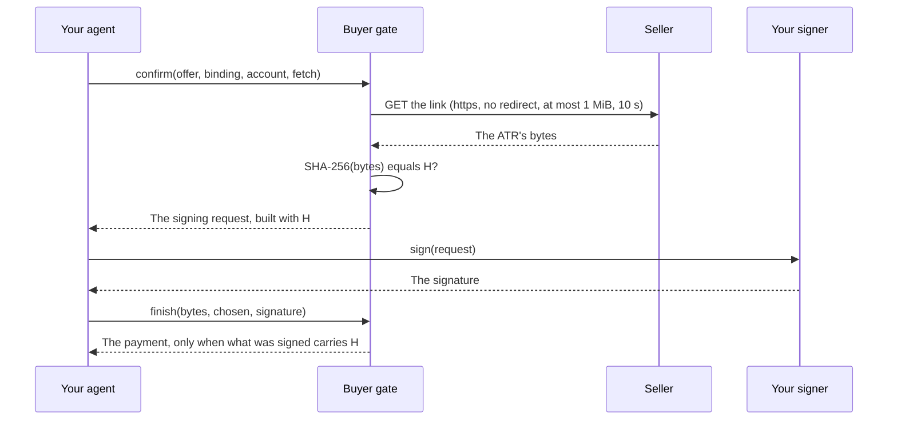

# @integraledger/terms

The buyer gate for agents that pay: before your wallet signs anything, it confirms that the record a seller serves
hashes to the value the payment will carry, and builds the payment with that hash.

```sh
npm install @integraledger/terms @integraledger/lcp
```

## What it is

A seller that follows the Legal Context Protocol publishes the agreement's record, an **Agentic Transaction Record
(ATR)**, at an `https` link, and advertises its hash beside the payment request. The payment your agent signs carries
that hash, so paying is agreeing to that exact record.

That only holds if the hash in the payment is the hash of the record you can read. This package is the check that makes
sure it is. It fetches the record, computes its SHA-256, compares it with what the seller advertised, and only on a
match hands your signer a request built with that hash. After your signer answers, it reads the hash back out of what
was signed and returns the payment only if it is still the hash of the bytes you received.

It runs in your process, with your HTTP client and your signer. It holds no keys, moves no funds, and never reads the
record's content: what the record says is for you and your principal to judge.

## Key concepts

- **Agentic Transaction Record (ATR):** the agreement's record, a JSON document the seller serves.
- **ATR hash (H):** SHA-256 over the ATR's exact bytes, `0x` and 64 hex digits. It is computed over the bytes as
  received, never over a parsed and re-serialised copy.
- **Legal Context Protocol (LCP):** the pattern this package implements: the payment carries H, so paying is agreeing
  to that exact record.
- **Pairing:** a payment protocol, scheme and rail combination, such as `x402/exact/eip155/eip3009`.
- **Binding:** how H rides in a pairing's payment, the field its specification defines. For
  `x402/exact/eip155/eip3009` it is the EIP-3009 `nonce`. Bindings are exported by
  [`@integraledger/lcp`](https://github.com/IntegraLedger/integra-protocol), one per pairing.
- **Buyer gate:** this package: the buyer-side check that compares the served bytes with H before anything is signed.
- **Seller:** the party serving the resource.
- **Facilitator:** the x402 role that verifies and settles. The gate never talks to one: it returns the payment to you.
- **Vectors:** the shared test cases that fix the rules byte for byte across languages. This package and the Python
  gate, [`integraledger-terms`](https://pypi.org/project/integraledger-terms/), pass the same ones.

## Install

```sh
npm install @integraledger/terms @integraledger/lcp
```

- Node.js `>=26.10.0`. ESM only.
- `@integraledger/lcp` is a dependency of this package; install it beside it to import the bindings you pass in.
- Chain libraries (`@solana/kit`, `@stellar/stellar-sdk` and others) are optional peers of `@integraledger/lcp`,
  needed only by the pairings that use them.

## Quickstart

The seller answered with an x402 `402 Payment Required` whose `PAYMENT-REQUIRED` document advertises H and the link.
This example pays it with [viem](https://viem.sh) as the wallet. It uses the ATR, the document and the payer key of
the shared vectors, and a local stand-in for the network, so it runs offline and prints the same values every time.

```ts
import { transact, type Fetch, type Signer } from "@integraledger/terms";
import { exactEip3009, type Eip3009Payment } from "@integraledger/lcp/x402";
import { privateKeyToAccount } from "viem/accounts";

// The ATR, exactly as the seller's link serves it. The gate hashes these bytes and never parses them.
const atr = new TextEncoder().encode(
  '{"atrVersion":"1","id":"0f8fad5b-d9cb-469f-a165-70867728950e","x402":{"z":1.0,"a":"caf\\u00e9"},"seller":{"note":"Café — 30 días ✓"}}',
);
const H = "0x8b1e122580ae3f6a8c3d36a24294e1260a87bde70f597279b973e39310072938";
const link = `https://atr.seller.example/${H}`;

// The seller's x402 payment request, advertising H and the link.
const offer = {
  x402Version: 2,
  resource: { url: "https://api.seller.example/v1/quote" },
  accepts: [
    {
      scheme: "exact",
      network: "eip155:84532",
      amount: "10000",
      asset: "0x036CbD53842c5426634e7929541eC2318f3dCF7e",
      payTo: "0x209693Bc6afc0C5328bA36FaF03C514EF312287C",
      maxTimeoutSeconds: 60,
      extra: { name: "USDC", version: "2" },
    },
  ],
  extensions: {
    legalContext: { info: { type: "sha256", value: H, legalContextUrl: link }, schema: {} },
  },
};

// A stand-in for the network: the link serves the ATR. In production, pass globalThis.fetch.
const fetch: Fetch = async (url) => (url === link ? new Response(atr) : new Response(null, { status: 404 }));

// The published Anvil development key. Never use it for real funds.
const wallet = privateKeyToAccount("0xac0974bec39a17e36ba4a6b4d238ff944bacb478cbed5efcae784d7bf4f2ff80");
const signer: Signer = {
  account: `eip155:84532:${wallet.address}`,
  async sign(request) {
    if (request.kind !== "eip712") throw new Error(`this wallet signs EIP-712 only, not ${request.kind}`);
    return wallet.signTypedData(request.typedData as Parameters<typeof wallet.signTypedData>[0]);
  },
};

const result = await transact(offer, exactEip3009, signer, fetch);
if ("decline" in result) throw new Error(`${result.decline.code}: ${result.decline.detail}`);

const payment = result.signed as Eip3009Payment;
console.log("H           ", result.h);
console.log("signed nonce", payment.payload.authorization.nonce);
console.log("kept bytes  ", result.bytes.length);

// x402 over HTTP sends the payment as base64 of its JSON, in the PAYMENT-SIGNATURE header.
const header = btoa(JSON.stringify(result.signed));
console.log("header      ", header.length > 0 ? "ready" : "empty");
```

```text output
H            0x8b1e122580ae3f6a8c3d36a24294e1260a87bde70f597279b973e39310072938
signed nonce 0x8b1e122580ae3f6a8c3d36a24294e1260a87bde70f597279b973e39310072938
kept bytes   138
header       ready
```

The nonce your wallet signed is the hash of the 138 bytes the link served. Keep `result.bytes` with the payment: they
are your copy of the record.

If the link had served one byte more, less or different, `transact` would have returned
`{ decline: { code: "hash-mismatch", … } }` and never called the signer.

## How it works



1. **Read.** The pairing's binding reads the seller's document: H, the link, and the payment options.
2. **Compare.** The gate fetches the link once and hashes the bytes it received. No match: a decline, and no signer
   call.
3. **Build.** On a match, the gate builds the payment with the hash it computed, not the string the seller advertised.
4. **Finish.** The gate joins your signer's answer, reads H back out of what was signed, and returns the payment only
   when it is the hash of the compared bytes.

Every function returns a value, never throws for a protocol outcome: either its result, or
`{ decline: { code, detail } }`.

## Guides

### Pay in one call: `transact`

`transact(doc, binding, signer, fetch, options?)` runs the whole order: compare, pay the agreement first where the
pairing needs one, sign, finish. Its result is:

| Member | What it is |
| --- | --- |
| `signed` | The payment to send, in the protocol's own form. `null` when the pairing gives the buyer nothing to sign. |
| `bytes` | The ATR's exact bytes: your copy of the record. |
| `h` | Their SHA-256. |
| `agreement` | The agreement's receipt, where an agreement was paid first. |
| `landed` | A landed receipt to keep beside the payment, for the few pairings that return one. |

`options` takes `inputs` (the buyer's own values a build needs, such as a recent blockhash) and `agreementSigner`
(the wallet that pays the agreement, where it is not `signer`). Any other member is declined before any fetch.

### Sign elsewhere: `confirm`, then `finish`

When the key lives in a hardware wallet or a signing service, split the order. `chosen` is plain JSON, so it crosses
process boundaries with the bytes:

```ts
import { confirm, finish, type Fetch } from "@integraledger/terms";
import { exactEip3009, type Eip3009Payment } from "@integraledger/lcp/x402";
import { privateKeyToAccount } from "viem/accounts";

const atr = new TextEncoder().encode(
  '{"atrVersion":"1","id":"0f8fad5b-d9cb-469f-a165-70867728950e","x402":{"z":1.0,"a":"caf\\u00e9"},"seller":{"note":"Café — 30 días ✓"}}',
);
const H = "0x8b1e122580ae3f6a8c3d36a24294e1260a87bde70f597279b973e39310072938";
const link = `https://atr.seller.example/${H}`;
const offer = {
  x402Version: 2,
  resource: { url: "https://api.seller.example/v1/quote" },
  accepts: [
    {
      scheme: "exact",
      network: "eip155:84532",
      amount: "10000",
      asset: "0x036CbD53842c5426634e7929541eC2318f3dCF7e",
      payTo: "0x209693Bc6afc0C5328bA36FaF03C514EF312287C",
      maxTimeoutSeconds: 60,
      extra: { name: "USDC", version: "2" },
    },
  ],
  extensions: { legalContext: { info: { type: "sha256", value: H, legalContextUrl: link }, schema: {} } },
};
const fetch: Fetch = async (url) => (url === link ? new Response(atr) : new Response(null, { status: 404 }));

// 1. Compare, and build the request with H.
const confirmed = await confirm(offer, exactEip3009, "eip155:84532:0xf39Fd6e51aad88F6F4ce6aB8827279cffFb92266", fetch);
if ("decline" in confirmed) throw new Error(confirmed.decline.code);
if (confirmed.request === null || confirmed.request.kind !== "eip712") throw new Error("expected an EIP-712 request");

// What crosses to the signing side and back: plain JSON and the bytes.
const handOff = JSON.stringify({ chosen: confirmed.chosen, atr: Buffer.from(confirmed.bytes).toString("base64") });

// 2. Sign exactly the request, elsewhere. The published Anvil development key; never use it for real funds.
const wallet = privateKeyToAccount("0xac0974bec39a17e36ba4a6b4d238ff944bacb478cbed5efcae784d7bf4f2ff80");
const signature = await wallet.signTypedData(
  confirmed.request.typedData as Parameters<typeof wallet.signTypedData>[0],
);

// 3. Finish from what came back. finish recomputes H from the bytes; it trusts nothing it did not rebuild.
const back = JSON.parse(handOff);
const done = await finish(new Uint8Array(Buffer.from(back.atr, "base64")), back.chosen, signature, exactEip3009);
if ("decline" in done) throw new Error(done.decline.code);
if ("next" in done) throw new Error("this pairing signs in one step");

console.log("nonce is H:", (done.signed as Eip3009Payment).payload.authorization.nonce === H);
```

```text output
nonce is H: true
```

A pairing signed in two steps (a channel funding, then its first voucher) makes `finish` return `{ next, h }`: sign
`next` and call `finish` again with every answer so far, in order, as a list. `transact` does this for you.

### Pay the agreement first

Some payments are not a public proof of H: a card charge, a Stripe payment, a Lightning invoice, a checkout in which
the buyer signs nothing. For those pairings the seller's offer also names an **agreement URL**, an x402 resource for the
same H whose payment is a public proof. `transact` pays it first, and signs the main payment only after the agreement
URL answers with its receipt:

```json
{
  "atrHash": "0x8b1e122580ae3f6a8c3d36a24294e1260a87bde70f597279b973e39310072938",
  "agreed": true,
  "network": "eip155:84532",
  "transaction": "0xabababababababababababababababababababababababababababababababab"
}
```

- The agreement URL's `402` must advertise the same H, or nothing is signed (`hash-mismatch`).
- Once the agreement payment is sent, the gate sends the same payment again after each `202`, `5xx` or timeout, within
  the agreement option's `maxTimeoutSeconds` plus 180 seconds. It never signs a second agreement payment.
- A pairing that needs an agreement and whose offer names none is declined with `agreement-not-offered`.
- `agree(h, url, signer, fetch, { bytes, inputs })` runs the exchange on its own, for an agent that drives each step.

### Channels and sessions

In an x402 batch-settlement channel or an MPP session, one ATR covers the whole channel. The gate compares it once, at
the opening; you keep a **hold** and sign every later voucher from it:

```ts
import { openChannel, recordCharge, transact, within, type Fetch, type Signature, type Signer, type SigningRequest } from "@integraledger/terms";
import { batchEvm } from "@integraledger/lcp/x402-batch-settlement";
import { privateKeyToAccount } from "viem/accounts";

const atr = new TextEncoder().encode(
  '{"atrVersion":"1","id":"0f8fad5b-d9cb-469f-a165-70867728950e","x402":{"z":1.0,"a":"caf\\u00e9"},"seller":{"note":"Café — 30 días ✓"}}',
);
const H = "0x8b1e122580ae3f6a8c3d36a24294e1260a87bde70f597279b973e39310072938";
const link = `https://atr.seller.example/${H}`;

// The seller's batch-settlement offer: 1000 units per request, into a channel.
const offer = {
  x402Version: 2,
  resource: { url: "https://api.seller.example/v1/quote" },
  accepts: [
    {
      scheme: "batch-settlement",
      network: "eip155:84532",
      amount: "1000",
      asset: "0x036CbD53842c5426634e7929541eC2318f3dCF7e",
      payTo: "0x209693Bc6afc0C5328bA36FaF03C514EF312287C",
      maxTimeoutSeconds: 3600,
      extra: { receiverAuthorizer: "0x90F79bf6EB2c4f870365E785982E1f101E93b906", withdrawDelay: 900, name: "USDC", version: "2" },
    },
  ],
  extensions: { legalContext: { info: { type: "sha256", value: H, legalContextUrl: link }, schema: {} } },
};
const fetch: Fetch = async (url) => (url === link ? new Response(atr) : new Response(null, { status: 404 }));

// Anvil development keys: the payer funds the channel, the payer authorizer signs vouchers. Never use them for real funds.
const payer = privateKeyToAccount("0xac0974bec39a17e36ba4a6b4d238ff944bacb478cbed5efcae784d7bf4f2ff80");
const authorizer = privateKeyToAccount("0x59c6995e998f97a5a0044966f0945389dc9e86dae88c7a8412f4603b6b78690d");
type TypedData = Parameters<typeof payer.signTypedData>[0];
const signer: Signer = {
  account: `eip155:84532:${payer.address}`,
  async sign(request: SigningRequest): Promise<Signature> {
    if (request.kind !== "batch") throw new Error(`unexpected ${request.kind}`);
    const answers: Signature[] = [];
    for (const each of request.requests) {
      const typedData = (each as { typedData: TypedData }).typedData;
      const key = typedData.primaryType === "Voucher" ? authorizer : payer;
      answers.push(await key.signTypedData(typedData));
    }
    return answers;
  },
};

// Open: compare the ATR once, sign the deposit and the first voucher.
const opened = await transact(offer, batchEvm, signer, fetch, {
  inputs: { payerAuthorizer: authorizer.address, deposit: "100000" },
});
if ("decline" in opened || opened.signed === null) throw new Error("the channel did not open");
let hold = await openChannel(opened.bytes, opened.signed, batchEvm);
if ("decline" in hold) throw new Error(hold.decline.code);
console.log("channel ", hold.channel);

// Each later request: the seller's new offer must advertise the held H.
for (const charged of ["1000", "2000"]) {
  const next = await within(offer, hold, batchEvm, signer);
  if ("decline" in next) throw new Error(next.decline.code);
  console.log("voucher up to", next.hold.signedMax);
  // The seller reports its cumulative charge; it may not exceed what was signed.
  const recorded = recordCharge(next.hold, charged);
  if ("decline" in recorded) throw new Error(recorded.decline.code);
  hold = recorded;
}
```

```text output
channel  0x9c2d7031768ecb3fe688ae307c45f2e3a3d98b0d9ce1a6afcd27131fabb67e56
voucher up to 1000
voucher up to 2000
```

The hold is plain JSON: store it, and pass the latest one to each call. `within` re-derives everything from the hold,
never from the new challenge, and signs only when that challenge advertises the held H.

### Confirm a payment later: `check`

`check(bytes, presented, binding)` confirms that a payment you hold carries, inside what was signed, the SHA-256 of the
bytes you kept. Where `finish` or `transact` returned `landed`, put it back into the payment as `landed` first.

### Declines and `moved`

A decline is `{ decline: { code, detail } }`. `code` is one of twelve values; `detail` is a sentence or the protocol
package's refusal code. Where your signer moved the payment itself before the gate declined (a Lightning node paid the
invoice, a signer broadcast a transaction), the decline also carries `moved: { signed, bytes, h }`. Keep it, and present
it again rather than signing a new payment.

| Code | Meaning |
| --- | --- |
| `pairing-not-supported` | The binding names no pairing the gate serves; `chosen` or a hold belongs to another pairing; the pairing has no channel; or the agreement URL's option is not paid with a public-proof pairing. |
| `offer-unreadable` | The seller's document, the chosen option or a build could not be read, or a recorded charge is out of range. `detail` carries the reason. |
| `no-payable-option` | No option is payable by this account, an input the build needs is missing or malformed, or `transact`'s options are malformed. |
| `link-not-https` | The ATR link or the agreement URL is not an `https` URL. Nothing was fetched. |
| `atr-unfetchable` | The link did not answer `200` with the bytes within 10 seconds (a redirect counts as a failure). |
| `atr-too-large` | The ATR is larger than 1 MiB (1,048,576 bytes). |
| `hash-mismatch` | The served bytes do not hash to the advertised H; the agreement URL or a later channel challenge advertises another H; or a hold's bytes do not hash to its H. Nothing was signed. |
| `signer-failed` | Your signer threw. |
| `signed-not-bound` | What was signed does not carry the hash of the compared bytes. The payment is not returned. |
| `agreement-not-offered` | The pairing's payment is not a public proof, and the offer names no agreement URL. |
| `agreement-pending` | The agreement payment was sent and is not yet recorded, or another is already settling. |
| `agreement-failed` | The agreement URL could not be reached, or answered with something other than a receipt for this H. |

## API reference

Everything below is exported from `@integraledger/terms`.

### Functions

| Export | Signature | What it does |
| --- | --- | --- |
| `transact` | `(doc, binding, signer, fetch, options?) => Promise<{ signed, bytes, h, agreement?, landed? } \| Declined>` | Compare, pay the agreement first where needed, sign, finish. |
| `confirm` | `(doc, binding, account, fetch, inputs?) => Promise<{ chosen, request, bytes, h, agreement? } \| Declined>` | Read, fetch, compare, and build the signing request with H. `request` is `null` when there is nothing to sign. |
| `finish` | `(bytes, chosen, signature, binding) => Promise<{ signed, h, landed? } \| { next, h } \| Declined>` | Rebuild from `chosen` and the bytes, join the signature, and return the payment only when what was signed carries H. |
| `check` | `(bytes, presented, binding) => Promise<{ h } \| Declined>` | Confirm a held payment carries the hash of the kept bytes. |
| `agree` | `(h, url, signer, fetch, { bytes, inputs?, ns? }) => Promise<{ receipt } \| Declined>` | Pay an agreement URL for H and return its receipt. |
| `openChannel` | `(bytes, opened, binding, landed?) => Promise<ChannelHold \| Declined>` | Hold a channel opened for the compared ATR. |
| `within` | `(doc, hold, binding, signer, refund?, inputs?) => Promise<{ signed, hold } \| Declined>` | Sign a later voucher, or a refund with `refund`, in a held channel. |
| `recordCharge` | `(hold, chargedCumulativeAmount) => ChannelHold \| Declined` | Record the seller's cumulative charge, between the last recorded and the most signed. |

### Types

| Export | What it is |
| --- | --- |
| `Binding` | A pairing's binding from `@integraledger/lcp`. |
| `Signer` | `{ account: string; sign(request: SigningRequest): Promise<Signature> }`. `account` is CAIP-10. |
| `SigningRequest` | What a signer is handed: one kind per signing scheme, such as `eip712`, `solana-message`, `xrpl-tx`, `bolt11-pay` or `batch`. |
| `Signature` | The signer's answer, as JSON. Byte strings are `0x` hex. |
| `Fetch` | WHATWG `fetch`, or anything with its call shape. |
| `Inputs` | The buyer's own values a build needs: `{ [name]: Json }`. |
| `TransactOptions` | `{ inputs?, agreementSigner? }`. |
| `Chosen` | What the gate chose to pay, as plain JSON: `{ pairing, choice, ref }`. |
| `Presented` | A payment in its protocol's form. |
| `AgreementReceipt` | `{ atrHash, agreed: true, network, transaction }`. |
| `ChannelHold` | `{ pairing, network, channel, h, atr, opening, charged, signedMax }`, all JSON. |
| `Declined` | `{ decline: Reason; moved?: { signed, bytes, h } }`. |
| `Reason` | `{ code: DeclineCode; detail: string }`. |
| `DeclineCode` | The twelve codes in the table above. |

The full reference, with every request kind and the answer it takes, is in the
[documentation](https://github.com/IntegraLedger/integra-agentic-terms/tree/main/docs).

## Supported pairings

Generated from `@integraledger/lcp`'s `BINDINGS` and the gate's own registry. "Agreement payment first" marks the
pairings whose payment is not itself a public proof of H. The
[pairings reference](https://github.com/IntegraLedger/integra-agentic-terms/blob/main/docs/reference/pairings.md) adds
what each payment proves, and the [rails guide](https://github.com/IntegraLedger/integra-agentic-terms/blob/main/docs/guides/rails.md)
the inputs each build reads.

<!-- pairings:typescript:start -->
| Rail | Pairing | Binding export | Buyer signs H | Agreement payment first |
| --- | --- | --- | --- | --- |
| EVM | `mpp/charge/evm/authorization` | `evmAuthorization` from `@integraledger/lcp/mpp` | yes | no |
| EVM | `mpp/charge/evm/hash` | `evmHash` from `@integraledger/lcp/mpp` | no | yes |
| EVM | `mpp/charge/evm/permit2` | `evmPermit2` from `@integraledger/lcp/mpp` | yes | no |
| EVM | `mpp/charge/evm/transaction` | `evmTransaction` from `@integraledger/lcp/mpp` | no | yes |
| EVM | `mpp/charge/usdc/evm` | `chargeUsdcEvm` from `@integraledger/lcp/mpp` | yes | no |
| EVM | `mpp/charge/usdc/gateway` | `chargeUsdcGateway` from `@integraledger/lcp/mpp` | yes | no |
| EVM | `mpp/session/evm` | `sessionEvm` from `@integraledger/lcp/mpp` | yes | no |
| EVM | `x402/auth-capture/eip155/eip3009` | `authCaptureEip3009` from `@integraledger/lcp/x402` | yes | no |
| EVM | `x402/auth-capture/eip155/permit2` | `authCapturePermit2` from `@integraledger/lcp/x402` | yes | no |
| EVM | `x402/batch-settlement/eip155` | `batchEvm` from `@integraledger/lcp/x402-batch-settlement` | yes | no |
| EVM | `x402/exact/eip155/eip3009` | `exactEip3009` from `@integraledger/lcp/x402` | yes | no |
| EVM | `x402/exact/eip155/erc7710` | `exactErc7710` from `@integraledger/lcp/x402` | no | yes |
| EVM | `x402/exact/eip155/erc7710-salt` | `exactErc7710Salt` from `@integraledger/lcp/x402` | yes | no |
| EVM | `x402/exact/eip155/permit2` | `exactPermit2` from `@integraledger/lcp/x402` | yes | no |
| EVM | `x402/upto/eip155/permit2` | `uptoPermit2` from `@integraledger/lcp/x402` | yes | no |
| Tempo | `mpp/charge/tempo/memo` | `tempoMemo` from `@integraledger/lcp/mpp` | no | no |
| Tempo | `mpp/charge/tempo/push` | `tempoPush` from `@integraledger/lcp/mpp` | no | no |
| Tempo | `mpp/session/tempo` | `sessionTempo` from `@integraledger/lcp/mpp` | yes | no |
| Tempo | `mpp/subscription/tempo` | `subscriptionTempo` from `@integraledger/lcp/mpp` | yes | no |
| Solana | `mpp/charge/solana` | `chargeSolana` from `@integraledger/lcp/mpp` | yes | no |
| Solana | `mpp/charge/usdc/solana` | `chargeUsdcSolana` from `@integraledger/lcp/mpp` | yes | no |
| Solana | `mpp/session/solana` | `sessionSolana` from `@integraledger/lcp/mpp` | no | no |
| Solana | `x402/batch-settlement/solana` | `batchSvm` from `@integraledger/lcp/x402-batch-settlement` | yes | no |
| Solana | `x402/exact/solana` | `exactSvm` from `@integraledger/lcp/x402-exact-solana` | yes | no |
| Solana | `x402/upto/solana` | `uptoSvm` from `@integraledger/lcp/x402-upto-solana` | yes | no |
| Stellar | `mpp/charge/stellar` | `chargeStellar` from `@integraledger/lcp/mpp` | no | no |
| Stellar | `x402/exact/stellar` | `exactStellar` from `@integraledger/lcp/x402-exact-stellar` | no | no |
| XRP Ledger | `mpp/charge/xrpl` | `chargeXrpl` from `@integraledger/lcp/mpp` | yes | no |
| XRP Ledger | `mpp/session/xrpl` | `sessionXrpl` from `@integraledger/lcp/mpp` | yes | no |
| XRP Ledger | `x402/exact/xrpl` | `exactXrpl` from `@integraledger/lcp/x402-exact-xrpl` | yes | no |
| Hedera | `mpp/charge/hedera` | `chargeHedera` from `@integraledger/lcp/hedera` | no | no |
| Hedera | `mpp/session/hedera` | `sessionHedera` from `@integraledger/lcp/mpp` | yes | no |
| Hedera | `x402/exact/hedera` | `exactHedera` from `@integraledger/lcp/hedera` | yes | no |
| Hedera | `x402/exact/hedera/transfer-executor` | `exactHederaExecutor` from `@integraledger/lcp/hedera` | no | yes |
| Algorand | `x402/exact/algorand` | `exactAvm` from `@integraledger/lcp/avm` | yes | no |
| Aptos | `x402/exact/aptos` | `exactAptos` from `@integraledger/lcp/aptos` | no | yes |
| Sui | `x402/exact/sui` | `exactSui` from `@integraledger/lcp/sui` | yes | no |
| NEAR | `mpp/charge/nearintents` | `chargeNearIntents` from `@integraledger/lcp/mpp` | no | yes |
| NEAR | `x402/exact/near` | `exactNear` from `@integraledger/lcp/near` | yes | no |
| Starknet | `x402/exact/starknet` | `exactStarknet` from `@integraledger/lcp/starknet` | yes | no |
| Polkadot | `x402/exact/polkadot/lcp-assets-remark` | `exactPolkadotRemark` from `@integraledger/lcp/polkadot` | yes | no |
| TRON | `x402/exact/tron/lcp-trc20-memo` | `exactTronMemo` from `@integraledger/lcp/tron` | yes | no |
| TON | `x402/exact/tvm` | `exactTvm` from `@integraledger/lcp/tvm` | yes | no |
| Cardano | `x402/exact/cardano` | `exactCardano` from `@integraledger/lcp/cardano` | yes | no |
| Casper | `x402/exact/casper` | `exactCasper` from `@integraledger/lcp/casper` | yes | no |
| Concordium | `x402/exact/ccd` | `exactCcd` from `@integraledger/lcp/ccd` | yes | no |
| Stacks | `mpp/charge/usdc/stacks` | `chargeUsdcStacks` from `@integraledger/lcp/mpp` | yes | no |
| Lightning | `mpp/charge/lightning` | `chargeLightning` from `@integraledger/lcp/lightning` | no | yes |
| Lightning | `mpp/session/lightning` | `sessionLightning` from `@integraledger/lcp/lightning` | no | yes |
| Lightning | `x402/exact/lnbtc` | `exactLnbtc` from `@integraledger/lcp/lightning` | no | yes |
| Lightning | `x402/exact/lnbtc/invoice-named` | `exactLnbtcNamed` from `@integraledger/lcp/lightning` | no | yes |
| Cloudflare | `x402/batch-settlement/cloudflare` | `batchCloudflare` from `@integraledger/lcp/x402-batch-settlement` | yes | yes |
| Card | `card/mastercard-vi/autonomous` | `viAutonomous` from `@integraledger/lcp/card` | yes | yes |
| Card | `card/mastercard-vi/immediate` | `viImmediate` from `@integraledger/lcp/card` | yes | yes |
| Card | `card/seller-reference` | `sellerReference` from `@integraledger/lcp/card` | no | yes |
| Card | `card/visa-tap` | `visaTap` from `@integraledger/lcp/card` | yes | yes |
| Card | `mpp/charge/card` | `chargeCard` from `@integraledger/lcp/mpp` | no | yes |
| Stripe | `mpp/charge/stripe` | `chargeStripe` from `@integraledger/lcp/mpp` | no | yes |
| Stripe | `mpp/subscription/stripe` | `subscriptionStripe` from `@integraledger/lcp/mpp` | no | yes |
| Mandate | `ap2/checkout-mandate` | `checkoutMandate` from `@integraledger/lcp/ap2` | yes | yes |
| Mandate | `ucp/booking/ap2-mandate` | `bookingAp2Mandate` from `@integraledger/lcp/ucp` | yes | yes |
| Mandate | `ucp/checkout/ap2-mandate` | `ap2Mandate` from `@integraledger/lcp/ucp` | yes | yes |
| Checkout | `ack/payment-request` | `paymentRequest` from `@integraledger/lcp/ack` | no | yes |
| Checkout | `acp/checkout/delegated` | `delegated` from `@integraledger/lcp/acp` | no | yes |
| Checkout | `acp/checkout/undelegated` | `undelegated` from `@integraledger/lcp/acp` | no | yes |
| Checkout | `ucp/booking/unsigned` | `bookingUnsigned` from `@integraledger/lcp/ucp` | no | yes |
| Checkout | `ucp/checkout/unsigned` | `unsigned` from `@integraledger/lcp/ucp` | no | yes |
<!-- pairings:typescript:end -->

## Security model

What the gate guarantees, in the code:

- **Nothing is signed before the comparison.** The signer is called only after SHA-256 of the served bytes equals the
  advertised H, compared as 32 decoded bytes.
- **The payment carries the computed hash.** The build takes the hash the gate computed, not the advertised string.
- **What was signed is read back.** `finish` returns a payment only when the binding reads, from what was signed, the
  hash of the compared bytes. For a pairing whose payment is not a public proof, the payment is returned only after the
  agreement's receipt for that hash.
- **One bounded fetch.** One `GET` of an `https` link, no redirect, one 10-second deadline over headers and body, at most
  1 MiB read. A declared or streamed length over the bound cancels the body.
- **Exact bytes.** The ATR is hashed as received and returned as received. It is never parsed.
- **No keys.** The gate hands requests to your signer and holds nothing that could sign.
- **Your network policy.** Every request goes through the `fetch` you pass.

What it does not do:

- It does not read or judge the ATR's content.
- It does not check amount, payee, asset, timing or payer against the ATR. A discrepancy is between the parties.
- It carries no business or legal logic.
- It does not store the ATR, talk to a facilitator, or settle a payment.

A seller's statement of what each pairing's payment proves is its binding's `pattern.proves`, in
`@integraledger/lcp`.

## Test vectors and conformance

The rules are fixed by the shared vectors that `@integraledger/lcp` ships in its `vectors/` directory: the buyer rows
of `buyer.json` (the hash, a record changed by one byte, the fetch bounds, the agreement exchange) and each pairing's
file (the request it builds and the payment it completes). This package's tests run every one, and the Python gate runs
the same files, so both languages compute the same hashes, build the same requests and give the same declines.

## Requirements

- Node.js `>=26.10.0`.
- An HTTP client with WHATWG `fetch`'s call shape (Node's global `fetch` is one).
- Cloudflare Workers, with or without the `nodejs_compat` flag: pass the Worker's own `fetch`, and install
  `@integraledger/lcp`'s optional peer dependencies before bundling. See
  [In a Cloudflare Worker](https://github.com/IntegraLedger/integra-agentic-terms/blob/main/docs/guides/pay-with-the-gate.md#in-a-cloudflare-worker).
- A signer for the pairings you pay.

## Contributing

See the [repository README](https://github.com/IntegraLedger/integra-agentic-terms#readme) and
[CONTRIBUTING.md](https://github.com/IntegraLedger/integra-agentic-terms/blob/main/CONTRIBUTING.md).

## License

[Apache-2.0](https://github.com/IntegraLedger/integra-agentic-terms/blob/main/agentic-terms/LICENSE)
