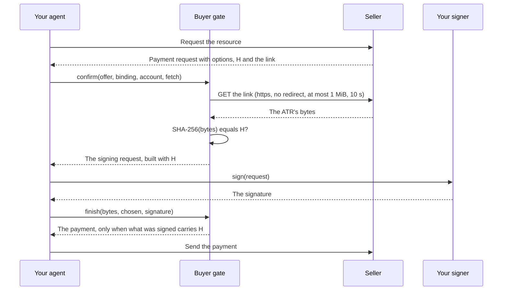

This page defines the terms the rest of the documentation uses. Each term has one meaning throughout.

## The record and its hash

**Agentic Transaction Record (ATR).** The agreement's record: a JSON document the seller serves. It holds the terms the
buyer pays under, in whatever form the parties chose. The seller publishes it at an `https` link before it asks for
payment.

**ATR hash (H).** SHA-256 over the ATR's exact bytes, written `0x` followed by 64 hexadecimal digits.

"Exact bytes" is the whole rule. H is computed over the bytes as they arrive, never over a parsed and re-serialised
copy. Two documents that mean the same JSON but differ in their bytes (`1.0` and `1`, `"café"` and `"caf\u00e9"`, a
space after a colon) have different hashes. The gate never parses the ATR: it hashes the bytes it received and compares.

**Legal Context Protocol (LCP).** The pattern these packages implement: the payment carries H, so paying is agreeing to
that exact record. The seller advertises H and the link beside its payment request. The buyer confirms that the link
serves bytes whose SHA-256 is H. The payment the buyer approves carries H.

## Pairings and bindings

**Pairing.** A payment protocol, scheme and rail combination, named by an id such as `x402/exact/eip155/eip3009`: the
x402 protocol, its `exact` scheme, on an EVM chain (`eip155`), paid with an EIP-3009 transfer authorization. The first
segment of the id is the protocol: `x402`, `mpp`, `card`, `ap2`, `ucp`, `acp` or `ack`.

**Binding.** How H rides in a pairing's payment: the field that pairing's specification defines. For
`x402/exact/eip155/eip3009` it is the EIP-3009 `nonce`: the buyer signs a transfer authorization whose nonce is H. For
`mpp/charge/solana` it is a Memo instruction in the signed transaction. Each pairing has exactly one binding.

In code, a binding is an object exported by [`@integraledger/lcp`](https://github.com/IntegraLedger/integra-protocol).
It has an `id`, a `read` that finds H and the link in the seller's document, a `build` that writes H into the payment,
and a `bound` that reads H back out of a signed payment. The Python package carries the same bindings as constants,
such as `X402_EXACT_EIP155_EIP3009`. The [pairings reference](./reference/pairings.md) lists every one.

## The buyer gate

**Buyer gate.** The buyer-side check that compares the served bytes with H before anything is signed. It runs in your
process, with your network client and your signer, in four steps:

1. **Read.** The pairing's binding reads the seller's document: the advertised H, the `https` link to the ATR, and the
   payment options.
2. **Compare.** The gate fetches the link once and computes SHA-256 over the bytes it received. If the result is not H,
   the gate declines with `hash-mismatch`, and your signer is never called.
3. **Build.** Only on a match does the gate build the payment, and it builds it with the hash it computed, not the
   string the seller advertised. The result is a signing request: exactly what your signer signs.
4. **Finish.** When your signer answers, the gate completes the payment and reads H back out of what was signed. It
   returns the payment only when that value is the hash of the bytes it compared.

`transact` runs the four steps in one call. `confirm` and `finish` split them for an agent whose signer lives elsewhere,
such as a hardware wallet or a separate signing service. `check` repeats the last step later, over a payment you hold
and the bytes you kept.

## How H rides in a payment

Protocols and rails offer different places for H. Each pairing's binding states its **pattern**, and what its payment
proves:

| Pattern | Where H sits |
| --- | --- |
| `native-field` | A field of the payment: a nonce, a memo, a salt, an invoice's metadata. |
| `id-reuse` | An identifier the protocol already defines, set to H or to a value computed from H, such as an EIP-3009 nonce computed from an MPP challenge whose id encodes H. |
| `truncated-field` | A field too small for 32 bytes, holding a prefix or the low bits of H. It matches H by prefix only. |
| `opaque-challenge` | The seller's challenge carries H in its id or its opaque reference, and the buyer's credential echoes that challenge. |
| `protocol-extension` | A field a protocol extension adds, which the buyer's agent signs beside the payment. |
| `http-advisory` | The seller's response advertises H and the link; the payment the buyer signs does not carry H. |

Three properties follow, and each pairing states them:

- **Buyer signs H.** Whether what the buyer's wallet signs contains H.
- **On chain.** Whether H is written to a public ledger when the payment settles.
- **Public proof.** Whether the payment is itself a public proof of H.

## Public proof and the agreement payment

Some payments are not a public proof of H: a card payment, a Stripe charge, a Lightning invoice, a checkout in which the
buyer signs nothing. For these pairings the seller's offer also names an **agreement URL**: an x402 resource for the same
H, paid with a pairing whose payment is a public proof, usually for a nominal amount. The gate pays the agreement first,
waits for its receipt, and only then signs the main payment. The
[agreement payments](./guides/agreement-payments.md) guide covers the exchange.

If such a pairing's offer names no agreement URL, the gate declines with `agreement-not-offered` and signs nothing.

## Channels and sessions

In a payment channel (x402 batch settlement) or a session (an MPP session), one ATR covers the whole channel. The gate
compares it once, at the opening. You keep the result as a **channel hold**: the ATR's bytes, the signed opening and the
channel it names. Each later voucher is signed from the hold, and only when the seller's new challenge advertises the
held hash. See [channels and sessions](./guides/channels-and-sessions.md).

## The parties

**Seller.** The party serving the resource. It assembles the ATR, stores it, serves it at the link, and advertises H in
its payment request.

**Facilitator.** The x402 role that verifies and settles a payment for the seller. The gate never talks to a
facilitator: it hands the payment back to you, and you send it to the seller.

**Signer.** Your wallet, or whatever holds your keys. The gate hands it one signing request at a time and never sees a
key.

## Vectors

**Vectors.** The shared test cases that fix the rules byte for byte across languages. The TypeScript gate and the Python
gate run the same vectors, from the `vectors/` directory of `@integraledger/lcp`, and produce the same hashes, the same
requests and the same declines. See [vectors](./reference/vectors.md).

## What the gate does not do

The gate makes sure the payment you sign carries the hash of the bytes you received. It does not:

- read, interpret or judge the ATR's content, which is for you and your principal to judge;
- check the amount, the payee, the asset, the timing or the payer against the ATR (a discrepancy is between the
  parties);
- carry any business or legal logic;
- hold keys, sign anything itself, or move funds;
- store the ATR: it returns the bytes, and keeping them is yours;
- talk to a facilitator or settle a payment.
