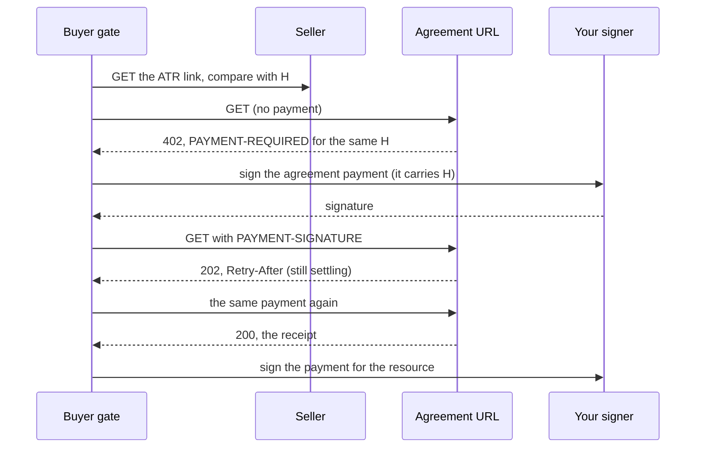

A card charge, a Stripe payment, a Lightning invoice, a checkout in which the buyer signs nothing: these payments do not
put H anywhere public. For such a pairing, the proof of agreement is a second, small payment that does: the
**agreement payment**. The seller names an **agreement URL** in its offer. The gate pays it before anything else, waits
until it is recorded, and only then signs the payment for the resource.

The [pairings reference](../reference/pairings.md) marks each pairing whose payment is not a public proof. In the
registry, it is `pattern.publicProof === false`.

## The exchange



1. **Compare.** The gate fetches and compares the ATR as for any pairing. A mismatch ends here.
2. **Ask.** The gate sends one `GET` to the agreement URL, with no payment, no redirect and a 10-second deadline. This
   request and every paid one ask for `Accept-Encoding: identity`; a `200` with any other `Content-Encoding` is
   `agreement-failed`, its body unread.
   - `200`: the agreement is already recorded. The body must be the receipt for this H.
   - `202`: another agreement payment for this ATR is settling. The gate declines `agreement-pending` and signs nothing.
   - `402`: the `PAYMENT-REQUIRED` header, base64 of an x402 document, is the agreement's payment request.
   - anything else: `agreement-failed`.
3. **Check the agreement's request.** Its first option must be paid with a pairing whose payment is itself a public
   proof, and its legal context must advertise the same H. Another H is `hash-mismatch`, and nothing is signed.
4. **Pay.** The gate builds that payment with H and hands it to your signer (or to `agreementSigner`, where you gave
   one). It sends it in the `PAYMENT-SIGNATURE` header.
5. **Wait for the receipt.** After a `202`, the gate waits the `Retry-After` seconds (2 when absent, at least 1) and sends
   **the same payment** again. After a `5xx` or a timeout it does the same after 2 seconds. Each paid request has a
   deadline of the option's `maxTimeoutSeconds` (at most 120) plus 70 seconds; the whole exchange ends at
   `maxTimeoutSeconds` plus 180 seconds, with `agreement-pending`. Any other answer, a redirect included, is
   `agreement-failed`. The gate never signs a second agreement payment.
6. **The receipt.** A `200` whose body is:

```json
{
  "atrHash": "0x8b1e122580ae3f6a8c3d36a24294e1260a87bde70f597279b973e39310072938",
  "agreed": true,
  "network": "eip155:84532",
  "transaction": "0xabababababababababababababababababababababababababababababababab"
}
```

   `atrHash` must be this H and `agreed` must be `true`. Anything else is `agreement-failed`, and the payment for the
   resource is never signed.

7. **Pay the resource.** Only then does the gate build and sign the payment the offer asked for. `transact` returns the
   receipt beside it as `agreement`.

Every decline after the agreement payment was sent carries it as `moved`: keep it and present it again.

## Example

The seller offers an ERC-7710 payment, whose signed form does not carry H, and names an agreement URL beside the link.
A local stand-in plays the seller and the agreement URL:

```ts
import { transact, type Fetch, type Signature, type Signer, type SigningRequest } from "@integraledger/terms";
import { exactErc7710 } from "@integraledger/lcp/x402";
import { privateKeyToAccount } from "viem/accounts";

const atr = new TextEncoder().encode(
  '{"atrVersion":"1","id":"0f8fad5b-d9cb-469f-a165-70867728950e","x402":{"z":1.0,"a":"caf\\u00e9"},"seller":{"note":"Café — 30 días ✓"}}',
);
const H = "0x8b1e122580ae3f6a8c3d36a24294e1260a87bde70f597279b973e39310072938";
const link = `https://atr.seller.example/${H}`;
const agreementUrl = `https://api.seller.example/agreement/${H}`;
const option = {
  scheme: "exact",
  network: "eip155:84532",
  asset: "0x036CbD53842c5426634e7929541eC2318f3dCF7e",
  payTo: "0x209693Bc6afc0C5328bA36FaF03C514EF312287C",
  maxTimeoutSeconds: 60,
};
const legalContext = { info: { type: "sha256", value: H, legalContextUrl: link }, schema: {} };

// The resource's offer: an ERC-7710 payment, with the agreement URL beside the link.
const offer = {
  x402Version: 2,
  resource: { url: "https://api.seller.example/v1/quote" },
  accepts: [{ ...option, amount: "10000", extra: { name: "USDC", version: "2", assetTransferMethod: "erc7710" } }],
  extensions: {
    legalContext: { ...legalContext, info: { ...legalContext.info, legalContextAgreementUrl: agreementUrl } },
  },
};
// The agreement URL's own payment request: one unit, paid with an EIP-3009 authorization whose nonce is H.
const agreementRequest = {
  x402Version: 2,
  resource: { url: agreementUrl },
  accepts: [{ ...option, amount: "1", extra: { name: "USDC", version: "2" } }],
  extensions: { legalContext },
};

const seen: string[] = [];
const fetch: Fetch = async (url, init) => {
  if (url === link) return new Response(atr);
  if (url !== agreementUrl) return new Response(null, { status: 404 });
  if (init.headers?.["PAYMENT-SIGNATURE"] === undefined) {
    seen.push("agreement URL: 402");
    return new Response(null, { status: 402, headers: { "PAYMENT-REQUIRED": btoa(JSON.stringify(agreementRequest)) } });
  }
  seen.push("agreement URL: paid, 200");
  return Response.json({ atrHash: H, agreed: true, network: "eip155:84532", transaction: `0x${"ab".repeat(32)}` });
};

// The published Anvil development key. Never use it for real funds.
const wallet = privateKeyToAccount("0xac0974bec39a17e36ba4a6b4d238ff944bacb478cbed5efcae784d7bf4f2ff80");
const signer: Signer = {
  account: `eip155:84532:${wallet.address}`,
  async sign(request: SigningRequest): Promise<Signature> {
    seen.push(`signer: ${request.kind}`);
    if (request.kind === "eip712") {
      return wallet.signTypedData(request.typedData as Parameters<typeof wallet.signTypedData>[0]);
    }
    if (request.kind === "erc7710") {
      // A delegation from the wallet's own ERC-7710 tooling; placeholder values for this stand-in.
      return { delegationManager: `0x${"11".repeat(20)}`, permissionContext: "0x1234", delegator: wallet.address };
    }
    throw new Error(`unexpected ${request.kind}`);
  },
};

const result = await transact(offer, exactErc7710, signer, fetch);
if ("decline" in result) throw new Error(`${result.decline.code}: ${result.decline.detail}`);
console.log(seen.join("\n"));
console.log("receipt for H:", result.agreement?.atrHash === H);
```

```text output
agreement URL: 402
signer: eip712
agreement URL: paid, 200
signer: erc7710
receipt for H: true
```

The signer was asked for the agreement payment (EIP-712, carrying H) first, and for the ERC-7710 delegation only after
the receipt.

## Driving the steps yourself

`agree(h, url, signer, fetch, { bytes, inputs })` runs steps 2 to 6 on their own and returns `{ receipt }`, for an
agent that confirms with `confirm`, pays the agreement, and finishes with `finish`:

1. `confirm` returns `agreement`, the URL, beside the request.
2. Call `agree` with `confirmed.h`, that URL, your signer, and `confirmed.bytes`.
3. Only with the receipt in hand, sign `confirmed.request` and call `finish`.

The MCP tools enforce the same order: `atr_confirm` returns no `request` until you pass the agreement's `receipt`.

## When the offer names no agreement URL

A pairing whose payment is not a public proof, in an offer with no agreement URL, is declined with
`agreement-not-offered` right after the comparison. Nothing is signed.
